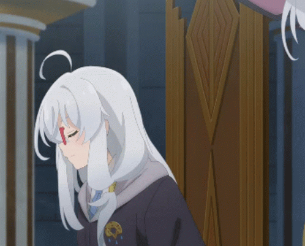

<h1 align="center"> JAZSI (Jaszi) </h1>

    

    

        <h2> About me </h2>
        
 Hi! I'm Jaszi. I am currently a high school student learning how to code.

        
    

    <li> <b>Loves:</b> Video games, Anime, Manga </li>
    <li> <b>Hobbies:</b> Origami, Papercrafts, Sports, Programming, Gaming </li>
    <li> <b>Games:</b> Overwatch, League of Legends, Genshin Impact, Honkai Impact, Minecraft, Tekken </li>
    <li> <b>Sports:</b> Basketball, Volleyball, Table tennis, Badminton, Squash
    <li> <b>Location:</b> Philippines :philippines:</li>
     
     

    <h2> Knowledge </h2>
    

        
        <b>I have experience in:</b>
         
         
        
        
        
        
        
        
        
        
        
        
        
        
        
        
        
        
    

     
     

    <h2> Socials </h2>
    
    
    
    
     
     
    
     
     

<!--
**JAZSI/JAZSI** is a ✨ _special_ ✨ repository because its `README.md` (this file) appears on your GitHub profile.

Here are some ideas to get you started:

- 🔭 I’m currently working on ...
- 🌱 I’m currently learning ...
- 👯 I’m looking to collaborate on ...
- 🤔 I’m looking for help with ...
- 💬 Ask me about ...
- 📫 How to reach me: ...
- 😄 Pronouns: ...
- ⚡ Fun fact: ...
-->
